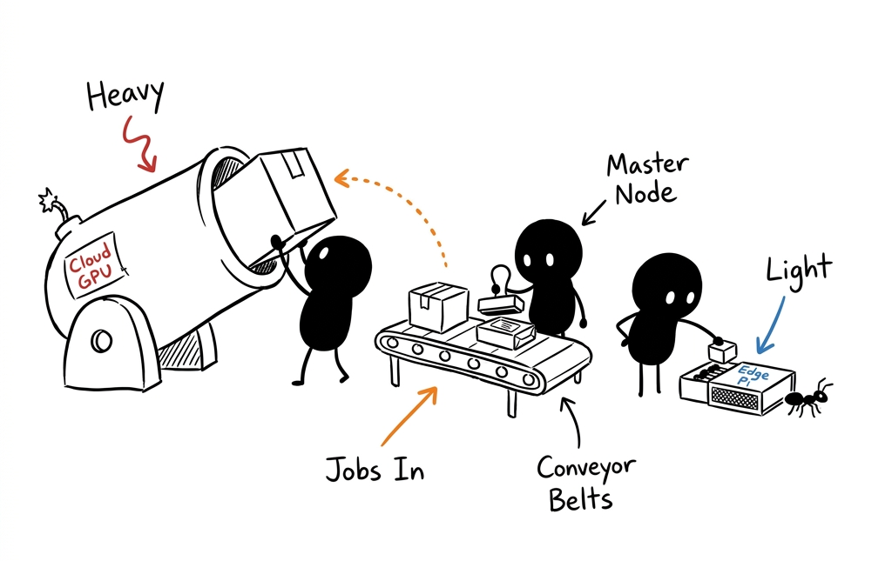
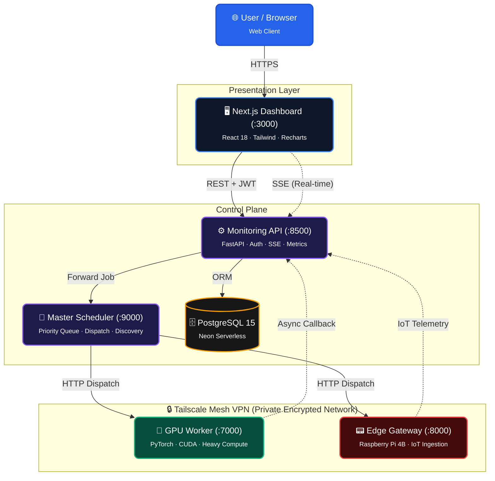

<div align="center">

# VisualPC

**Hybrid Cloud–Edge GPU Platform-as-a-Service**

Distributed compute workload orchestration, real-time monitoring, and GPU job scheduling across cloud, edge, and local execution planes.

[](https://github.com/Kesav2k04/visualpc/actions)
[](https://doi.org/10.5281/zenodo.20866268)
[](https://visualpc.vercel.app)
[](LICENSE)
[](https://www.python.org/)
[](https://nextjs.org/)
[](https://fastapi.tiangolo.com/)
[](https://www.postgresql.org/)
</div>

---

## Overview

VisualPC is a **distributed GPU compute platform** that orchestrates workloads across cloud GPU workers, edge IoT gateways (Raspberry Pi), and local compute nodes. It provides a real-time monitoring dashboard, priority-based job scheduling, and a production-ready monitoring API — all connected through a secure Tailscale mesh VPN.

<div align="center">
  
  <br>
  <em>Master Node dispatches heavy compute to Cloud GPU and lightweight tasks to Edge nodes.</em>
</div>

### Key Features

- 🖥️ **Real-time Dashboard** — Live monitoring of GPU workers, job queues, and performance metrics
- ⚡ **Priority Scheduler** — Master node with priority-based job dispatch to GPU workers
- 📊 **Metrics & Visualization** — Execution time, GPU memory, latency charts with historical tracking
- 🔐 **JWT Authentication** — Secure API access with role-based auth (admin/user)
- 🌐 **OAuth Integration** — Google and GitHub SSO support (optional)
- 🍓 **Edge Computing** — Raspberry Pi gateway for IoT workload ingestion
- 🐳 **Docker Ready** — Full-stack deployment with `docker-compose`
- 📡 **SSE Real-time Updates** — Server-Sent Events for live dashboard data
- 🔄 **Worker Auto-Discovery** — Dynamic worker registration with heartbeat monitoring

---

## Architecture



### Component Summary

| Component | Technology | Port | Role |
|-----------|-----------|------|------|
| **Dashboard** | Next.js 16, Tailwind CSS, Recharts, Framer Motion | 3000 | Real-time monitoring UI |
| **Monitoring API** | FastAPI, SQLAlchemy, PostgreSQL | 8500 | Data layer, auth, metrics, SSE |
| **Master Scheduler** | FastAPI, PriorityQueue | 9000 | Job scheduling & GPU dispatch |
| **GPU Worker** | FastAPI, PyTorch, CUDA | 7000 | Workload execution |
| **Edge Gateway** | FastAPI, Raspberry Pi | 8000 | IoT ingestion & forwarding |

### Data Flow

1. **Submit** → User submits job via Dashboard → Monitoring API creates DB record → forwards to Master
2. **Schedule** → Master picks highest-priority job → resolves online GPU worker → dispatches
3. **Execute** → GPU Worker runs CUDA/PyTorch workload → returns execution metrics
4. **Callback** → Master notifies Monitoring API → metrics inserted into PostgreSQL
5. **Visualize** → Dashboard polls API (SSE) → renders real-time charts and worker status

---

## Quick Start

### Prerequisites

- **Python 3.11+**
- **Node.js 18+**
- **PostgreSQL 15+**

### 1. Clone & Configure

```bash
git clone https://github.com/Kesav2k04/visualpc.git
cd visualpc

# Create environment file
cp .env.example backend/.env
# Edit backend/.env — set your DATABASE_URL at minimum
```

### 2. Backend Setup

```bash
# Install Python dependencies
pip install -r backend/requirements.txt

# Initialize database (creates tables + seeds admin user)
# Note: Features built-in retry-logic to handle serverless database wake-ups (e.g. Neon/Render)
python -m backend.migrate
python -m backend.init_db

# Start Monitoring API (port 8500)
python -m uvicorn backend.metrics_api:app --host 0.0.0.0 --port 8500
```

### 3. Master Scheduler

```bash
# In a new terminal, from repo root
python master.py
# Runs on port 9000
```

### 4. Frontend Setup

```bash
cd frontend
npm install

# Create frontend env
cp .env.example .env.local
# Edit .env.local if needed

npm run dev
# Open http://localhost:3000
```

### 5. Login

Default admin credentials (set via `ADMIN_BOOTSTRAP_PASSWORD` env var):

| Username | Password | Role |
|----------|----------|------|
| `admin` | Value of `ADMIN_BOOTSTRAP_PASSWORD` (default: see `.env.example`) | Admin |

> **⚠️ Production:** Always change `ADMIN_BOOTSTRAP_PASSWORD` to a strong password.

---

## Docker Deployment

Deploy the full stack with a single command:

```bash
# Build and start all services
docker-compose up --build -d

# Services:
#   PostgreSQL:    localhost:5432
#   Monitoring API: localhost:8500
#   Master:         localhost:9000
#   Frontend:       localhost:3000
```

### Environment Overrides

```bash
# Set GPU worker URL for real deployments
GPU_WORKER_URL=http://<worker-ip>:7000/execute-job \
VISUALPC_SECRET_KEY=your-production-secret \
docker-compose up --build -d
```

---

## Environment Variables

| Variable | Default | Service | Description |
|----------|---------|---------|-------------|
| `DATABASE_URL` | **(required)** | Backend | PostgreSQL connection string |
| `VISUALPC_SECRET_KEY` | `visualpc-demo-secret` | Backend | JWT signing secret |
| `FASTAPI_SECRET_KEY` | ← same as above | Backend | Alias for JWT secret |
| `ADMIN_BOOTSTRAP_PASSWORD` | `visualpc2026` | Backend | Default admin password (change in production!) |
| `MASTER_NODE_URL` | `http://localhost:9000` | Backend | Master scheduler URL |
| `GPU_WORKER_PORT` | `7000` | Backend | Default worker port for reachability |
| `ALLOWED_ORIGINS` | `http://localhost:3000` | Backend | CORS allowed origins |
| `GPU_WORKER_URL` | `http://localhost:7000/execute-job` | Master | GPU worker endpoint |
| `MONITOR_API_URL` | `http://localhost:8500` | Master | Monitoring API for callbacks |
| `NEXT_PUBLIC_API_BASE` | `http://localhost:8500` | Frontend | API base URL |
| `NEXT_PUBLIC_API_URL` | *(empty)* | Frontend | Alias for API base URL (Vercel compatibility) |
| `NEXTAUTH_SECRET` | **(required)** | Frontend | NextAuth.js session secret |
| `NEXTAUTH_URL` | `http://localhost:3000` | Frontend | NextAuth.js base URL |
| `GOOGLE_CLIENT_ID` | *(empty)* | Frontend | Google OAuth client ID |
| `GOOGLE_CLIENT_SECRET` | *(empty)* | Frontend | Google OAuth client secret |
| `GITHUB_ID` | *(empty)* | Frontend | GitHub OAuth app ID |
| `GITHUB_SECRET` | *(empty)* | Frontend | GitHub OAuth app secret |

---

## API Reference

### Authentication

| Endpoint | Method | Auth | Description |
|----------|--------|------|-------------|
| `/auth/login` | POST | No | Login → returns JWT |
| `/auth/register` | POST | No | Register new user |

### Jobs

| Endpoint | Method | Auth | Description |
|----------|--------|------|-------------|
| `/jobs` | GET | JWT | List all jobs |
| `/jobs` | POST | JWT | Submit new job (auto-forwards to scheduler) |
| `/jobs/{id}/status` | PUT | No | Completion callback from master |

### Workers

| Endpoint | Method | Auth | Description |
|----------|--------|------|-------------|
| `/workers` | GET | JWT | List workers with computed status |
| `/workers/available` | GET | No | Workers for scheduler |
| `/register-worker` | POST | No | Register/upsert a worker |
| `/worker/{id}/heartbeat` | POST | No | Worker heartbeat |

### Metrics & Health

| Endpoint | Method | Auth | Description |
|----------|--------|------|-------------|
| `/health` | GET | No | System health check |
| `/ready` | GET | No | Readiness probe |
| `/alive` | GET | No | Liveness probe |
| `/metrics` | GET | JWT | Raw metrics data |
| `/metrics/summary` | GET | JWT | Aggregated stats for charts |
| `/metrics/export` | GET | JWT | CSV download |
| `/ingest` | POST | JWT | Import metrics from `Metrics/` folder |
| `/events` | GET | No | SSE real-time stream |

### Master Scheduler

| Endpoint | Method | Description |
|----------|--------|-------------|
| `/health` | GET | Scheduler health |
| `/receive-job` | POST | Receive job from monitoring API |
| `/schedule-next` | GET | Trigger next dispatch |
| `/job-status/{id}` | GET | Job status lookup |
| `/metrics/summary` | GET | Scheduling metrics |

---

## Edge Node (Raspberry Pi)

VisualPC supports Raspberry Pi edge nodes as IoT ingestion gateways.

See **[docs/edge-node-setup.md](docs/edge-node-setup.md)** for the full setup guide, including:
- Hardware requirements
- Tailscale VPN configuration
- Automated bootstrap script
- systemd service setup

**Quick start:**
```bash
# On the Pi
./scripts/pi-bootstrap.sh

# Register with monitoring API
python scripts/register_worker.py \
  --name "edge-pi-01" \
  --ip <pi-tailscale-ip> \
  --port 8000
```

---

## Research & Metrics

The `research/` directory contains experiment scripts and data used for performance evaluation:

- **Latency comparison** — Cloud-only vs. hybrid edge-cloud execution
- **GPU execution time** — Workload scaling across small/medium/large
- **GPU memory usage** — Peak memory profiling under load
- **End-to-end latency breakdown** — Queue wait, dispatch, execution phases

Pre-generated figures are in `docs/images/`.

---

## Testing

```bash
# Backend integration tests (requires backend + master running)
python -m pytest tests/test_integration.py -v

# End-to-end pipeline test
python -m pytest tests/test_e2e_pipeline.py -v

# Frontend Playwright tests
cd frontend
npx playwright install --with-deps chromium
npx playwright test --reporter=list
```

---

## Project Structure

```
visualpc/
├── backend/                     # Monitoring API (FastAPI :8500)
│   ├── auth.py                  # JWT authentication & password hashing
│   ├── config.py                # Environment variable loading
│   ├── database.py              # SQLAlchemy engine & session
│   ├── init_db.py               # Database seeding
│   ├── metrics_api.py           # FastAPI endpoints (778 lines)
│   ├── migrate.py               # Idempotent DB migrations
│   ├── models.py                # ORM models (Worker, Job, Metric, User)
│   └── requirements.txt         # Python dependencies
├── frontend/                    # Dashboard (Next.js :3000)
│   ├── src/app/                 # App Router pages
│   ├── src/components/          # React components (charts, tables, sidebar)
│   ├── src/hooks/               # Custom hooks (useMetrics, useSSE)
│   ├── src/services/            # API client & auth helpers
│   ├── tests/                   # Playwright E2E tests
│   ├── Dockerfile               # Multi-stage production build
│   └── package.json
├── master.py                    # Master scheduler (FastAPI :9000)
├── scripts/
│   ├── register_worker.py       # GPU worker registration & heartbeat
│   ├── start-backend.bat        # Windows backend startup
│   └── pi-bootstrap.sh          # Raspberry Pi automated setup
├── tests/                       # Backend integration tests
├── research/                    # Experiment scripts & data
│   ├── experiments/             # GPU benchmark & plotting scripts
│   ├── data/                    # CSV metrics data
│   └── review_docs/             # Academic review materials
├── docs/
│   ├── images/                  # Architecture diagrams & result figures
│   ├── edge-node-setup.md       # Raspberry Pi setup guide
│   ├── CONTRIBUTING.md          # Contribution guidelines
│   └── VERIFICATION.md          # Testing checklist
├── Metrics/                     # Runtime experiment data (metrics.json)
├── certs/
│   └── generate_cert.py         # TLS certificate generator
├── .github/workflows/ci.yml     # CI/CD pipeline
├── docker-compose.yml           # Full-stack deployment
├── Dockerfile.backend           # Backend container image
├── .env.example                 # Environment variable template
├── .gitignore
├── LICENSE                      # MIT
├── SECURITY.md                  # Security policy
└── README.md
```

---

## Deployment

| Component | Recommended Platform | Notes |
|-----------|---------------------|-------|
| **Frontend** | [Vercel](https://vercel.com) | Auto-deploy from GitHub, set `NEXT_PUBLIC_API_URL` |
| **Backend API** | [Render](https://render.com) / Railway | Dockerfile deployment |
| **PostgreSQL** | [Neon Serverless](https://neon.tech) | Robust retry-handling for serverless environments |
| **Master Scheduler** | Same as backend | Deploy as separate service |
| **GPU Worker** | Local / Cloud GPU | Manual with `register_worker.py` |
| **Edge Node** | Raspberry Pi | Use `scripts/pi-bootstrap.sh` |

---

## Contributing

See [docs/CONTRIBUTING.md](docs/CONTRIBUTING.md) for guidelines.

## Contributors

- **Kesav Kumar J** — System Architecture, Master Node, Edge Node, Frontend, Backend, Orchestration, Deployment
- **Rishi Raghavendran** — GPU Worker Node, CUDA Execution, Documentation

## Security

See [SECURITY.md](SECURITY.md) for our security policy and responsible disclosure process.

## License

This project is licensed under the **MIT License** — see [LICENSE](LICENSE) for details.
